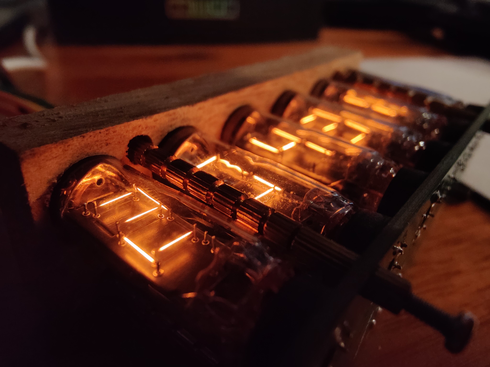
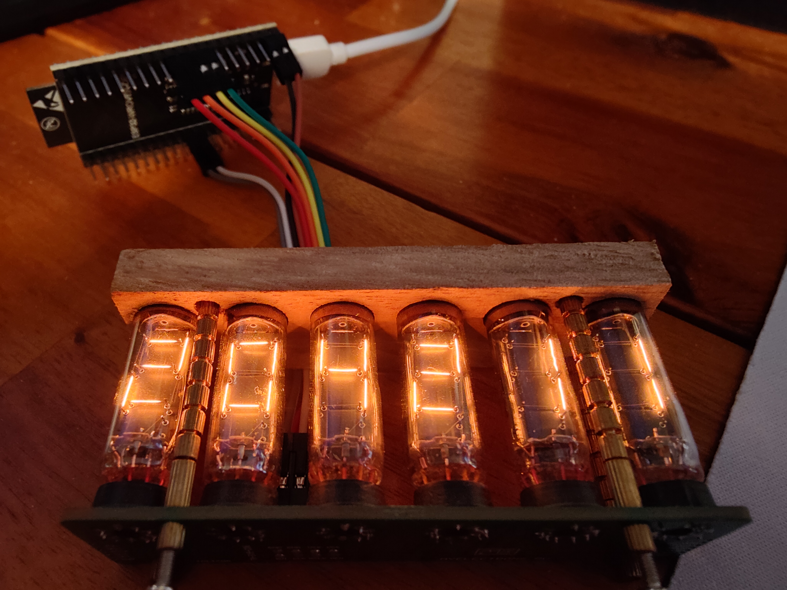
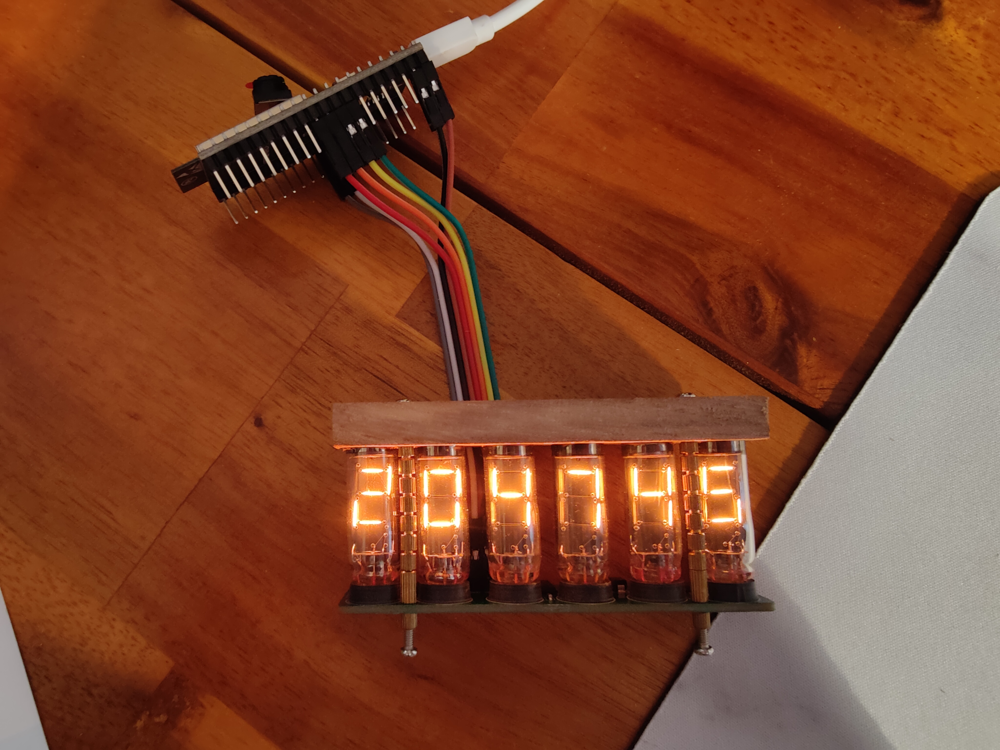

# Clock

Clock project currently based on ESP32-WROVER-E board with Arduino development environment on PlatformIO.

Display uses small nixie tubes on a home designed circuitboard with SPI control.

## TODO
- [x] correct for utc deviation
- [x] remove "delay" used for timing the clock
- [ ] add loading animation on powerup while waiting for ntp time
- [ ] use OE to even out display segment turn on & off time
- [ ] resynchronize with ntp every set time interval
- [ ] search how to automatically find utc deviation
- [ ] integration with mobile app to connect to wifi

- [ ] connect specialized RTC chip with reserve power
- [ ] connect gps as wifi alternative
- [ ] connect secondary screen
- [ ] connect temperature sensor
- [ ] connect pressure sensor
- [ ] connect humidity sensor
- [ ] lcd display w/ clock settings & internal info on the backside of the clock, a clickable rotating dial for input
- [ ] e-ink display for date display and maybe other info
- [ ] back panel with additional lamps for dots between the numbers
- [ ] PIR/movement sensor to regulate clock brightness
- [ ] light sensor or sun rise/set calculation to determine max screen brightness